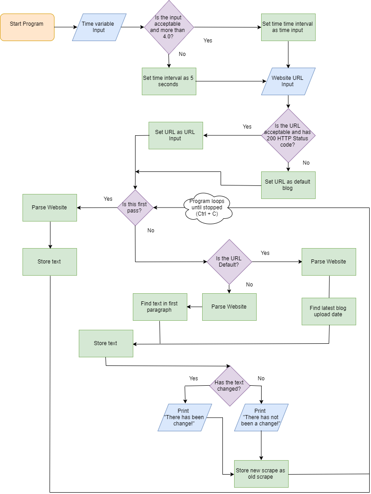

# webscrape

## Created by Nathan Jesudason

### Requires Python 2.7.X 

Webscrape uses BeautifulSoup4, make sure to install it inside of your virtual environment.

```
easy_install pip
pip install BeautifulSoup4
```

Includes a .gitignore file, which means that Github doesn't see any text files or anything in a .lpvenv folder. This file is so that you can directly create a virtual environment where the repository is without GitHub noticing it, and any text files from testing the webscraper won't be saved. This system requires that the virtual environment is a folder named `.lpvenv`

## How to access

Inside terminal, type `python scrape.py` to run program if you are inside of a virtual environment, otherwise type `python scrape.py`. To exit the program at any time press ctrl+c. It will then ask how frequently you want to check the url. Testing has shown that setting the time interval for longer than two minutes may work best. Using shorter times, such as seconds, means that many more scrapes will pass before the webscraper actually detects the website update (YMMV). Next the program asks for a url. If the url fails for whatever reason, a default url will be given.

## Flowchart



## Attributions

Tutorial followed [here](https://medium.freecodecamp.org/how-to-scrape-websites-with-python-and-beautifulsoup-5946935d93fe) 
